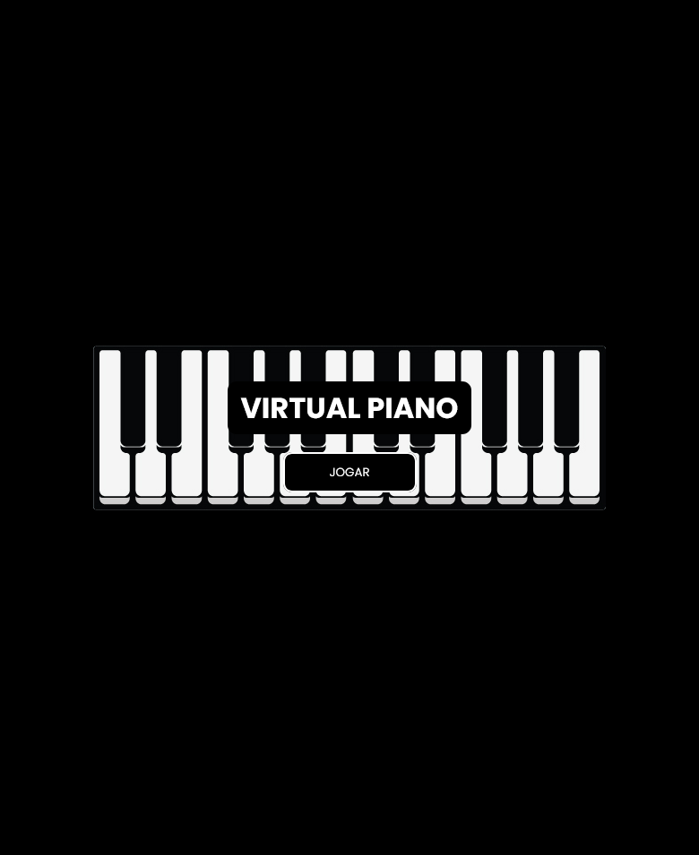
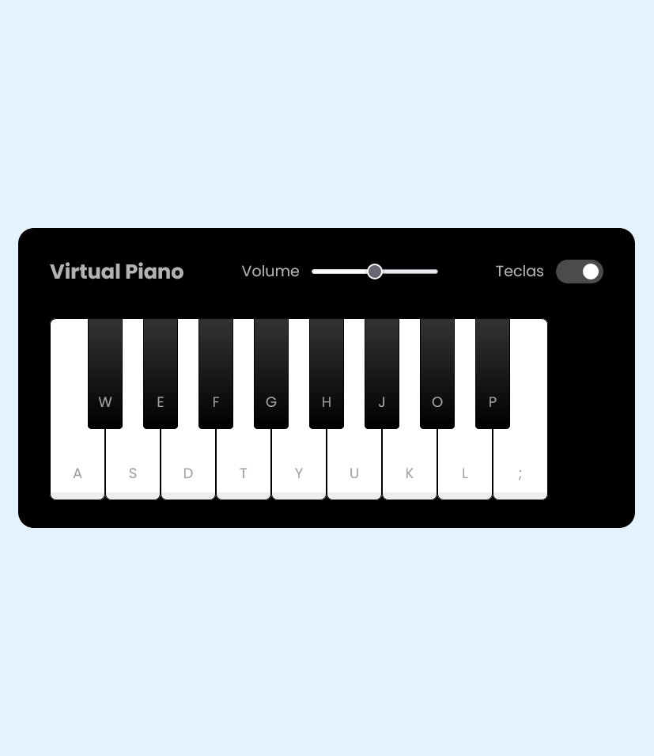

# 🎹 Virtual Piano Simulator 🎹

## 🛠 Sobre o Projeto

O **Virtual Piano Simulator** é um jogo interativo onde você pode tocar piano virtualmente utilizando tanto o teclado do computador quanto cliques no mouse. Foi desenvolvido como parte do bootcamp oferecido pela **Dio (Digital Innovation One)** em parceria com a **RiHappy**, durante as aulas conduzidas por um professor.

Após a conclusão do projeto inicial, foram adicionadas melhorias pessoais para aprimorar a experiência do usuário. O jogo agora conta com uma **tela inicial personalizada**, e há planos para implementar outras funcionalidades no futuro! 🚀

---
## 🧪 Teste o Projeto

Você pode acessar o projeto em funcionamento no seguinte link:  
[**Virtual Piano Simulator**](https://marlonalvss.github.io/js-music-keyboard-virtual/)

---

## ✨ Funcionalidades

- 🎼 **Toque o piano usando o teclado ou o mouse**: Cada tecla corresponde a uma nota musical, representada por letras. 
- 🔊 **Controle o volume**: Ajuste o volume com um slider interativo.
- 🔒 **Ocultar/Exibir teclas**: Ative ou desative a exibição das teclas no piano.
- 🖼 **Tela inicial**: Adicionada uma introdução ao jogo, oferecendo uma interface mais amigável.

---

## 🛠 Tecnologias Utilizadas

O projeto foi desenvolvido com as seguintes tecnologias:  

- **HTML** 🖋️  
- **CSS** 🎨  
- **JavaScript** ✨  

---

## 🎮 Demonstração do Projeto

### Tela Inicial:

### Tela do Jogo:

---

## 💡 Melhorias Pessoais

Durante a personalização do projeto, foram implementadas algumas melhorias, como:

- **Tela inicial**: Uma interface para introduzir o jogador antes de entrar no jogo.  
- **Aprimoramentos visuais**: Ajustes no design para tornar o jogo mais atrativo.   
---

## 🔮 Futuras Melhorias

- 🎵 **Adição de mais sons e oitavas**: Possibilidade de expandir o teclado com mais notas.  
- 📱 **Modo responsivo avançado**: Ajuste para melhorar a usabilidade em diferentes dispositivos.  

---

## 🎓 Agradecimentos

Agradeço à **Digital Innovation One** e à **RiHappy** por proporcionarem este bootcamp incrível!  

---

## 🔗 Conecte-se Comigo

Gostou do projeto? Vamos nos conectar!  
Acesse meu LinkedIn e acompanhe meus outros projetos:  

